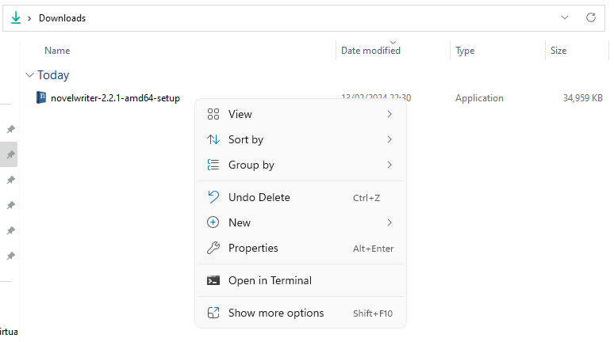
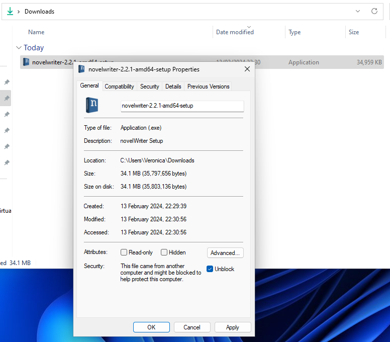
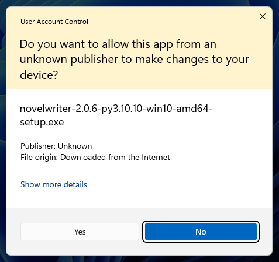

.. _main_install_windows:

*********************
Installing on Windows
*********************

.. _GitHub Releases: https://github.com/vkbo/novelWriter/releases
.. _SHA256: https://en.wikipedia.org/wiki/SHA-2

The novelWriter installer is not signed, so you will therefore be presented with security warnings
when trying to install it on your PC. All this means is that Windows doesn't know who created the
install file.

Knowing where you download software from is important, so make sure you **only** download the
installer from either here on the novelwriter.io website, or directly from the project's
`GitHub Releases`_ page. All download links on this website also point to the GitHub Releases page.
**It is the only official source of downloads for Windows**.

.. tip::

   You can verify that you received the correct installer by checking the SHA256_ sum. A SHA sum is
   a long number that is unique for a given file. It will only be identical for an identical copy
   of the file. The correct value is listed nearby where you downloaded the installer, either on
   the :ref:`Home <main_home>` page or the :ref:`main_download` page. You can also download the
   ``.sha256`` file on the `GitHub Releases`_ page alongside the installer.

In order to get rid of the "Unknown Publisher" warnings in Windows, I would have to buy a code
signing certificate that Microsoft accepts. They cost several hundred US dollars per year -- for
the cheap ones. This is a free app, and there is nowhere near enough donations made to this project
to pay for that at this point.

Sometimes, Windows will try to prevent you from installing unknown applications. Below is a quick
guide on how to disable the block for the novelWriter installer file.

Windows 11 and Windows Defender
===============================

When you've downloaded the installer, and try to run it, Windows Defender may not allow you to run
it. This is due to the missing signature, as mentioned above.

You can explicitly unblock the installer by going to your Downloads folder, find the novelWriter
installer file, right click it, and select **"Properties"**.

In the **"Properties"** window that opens up, make sure you're on the **"General"** tab, and check
the **"Unblock"** check box at the bottom next to **"Security"**.

You should now be able to run the installer.

It will still show you this notification when you start the installation, again reminding you that
the installer is from an **"Unknown Publisher"**. Select **"Yes"** to continue.

.. _main_install_win_content:

What's in the Installer File?
=============================

.. _Qt Framework: https://www.qt.io/
.. _Python Website: https://www.python.org/downloads/

The installed files for novelWriter are usually located in:

``C:\Program Files\novelWriter``

Since novelWriter is written in pure Python, there is no executable binary file (``.exe`` file).
Instead, novelWriter comes with the official Python executable included. This executable is
called ``python.exe``, and is signed by the "Python Software Foundation". Most of the other files
in the main folder are also for Python. They are included in the installer from the
`Python Website`_ when it is created.

The start script for novelWriter is called ``novelWriter.pyw``, and all of the code for it is in
the ``novelwriter`` folder. The app code is in a number of ``.py`` files, and they are all readable
in for instance Notepad. There are also a number of ``.pyc`` files, which are performance enhanced
versions of the ``.py`` files, generated by Python. If you delete them, they will be created again
the next time you run the app.

In addition to its own code, novelWriter depends on a few libraries. They are located in the
``lib`` folder:

* ``PyQt5`` is the framework that novelWriter is built upon. It is a Python wrapper library for
  the `Qt Framework`_.
* ``lxml`` is an XML library currently used by novelWriter (it will be removed in release 2.1).
* ``enchant`` is a spell checker library that provides spell checking capabilities for novelWriter.

That's all.
