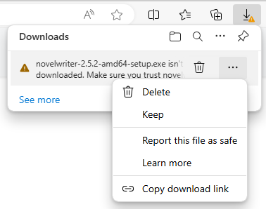

.. _main_install_windows:

*********************
Installing on Windows
*********************

.. _GitHub Releases: https://github.com/vkbo/novelWriter/releases
.. _SHA256: https://en.wikipedia.org/wiki/SHA-2
.. _SignPath.io: https://about.signpath.io/
.. _SignPath Foundation: https://signpath.org/

As of release 2.5.2, the novelWriter installer for Windows is signed by the `SignPath Foundation`_.
Earlier versions were not, and will warn that the installers are not signed.

However, even if the installer is signed, your browser may issue a warning that the application
isn't commonly downloaded. In for instance Edge, you can click the three dots next to the download
and select "Keep". You may have to also click "Show more" and "Keep anyway."

If you use another browser, you may see a similar warning.

Knowing where you download software from is important, so make sure you **only** download the
installer from either here on the novelwriter.io website, or directly from the project's
`GitHub Releases`_ page. All download links on this website also point to the GitHub Releases page.
**It is the only official source of downloads for Windows**.

.. tip::

   You can verify that you received the correct installer by checking the SHA256_ sum. A SHA sum is
   a long number that is unique for a given file. It will only be identical for an identical copy
   of the file. The correct value is listed nearby where you downloaded the installer, either on
   the :ref:`Home <main_home>` page or the :ref:`main_download` page. You can also download the
   ``.sha256`` file on the `GitHub Releases`_ page alongside the installer.

.. _main_install_win_content:

What's in the Installer File?
=============================

.. _Qt Framework: https://www.qt.io/
.. _Python Website: https://www.python.org/downloads/

The installed files for novelWriter are usually located in:

``C:\Program Files\novelWriter``

Since novelWriter is written in pure Python, there is no executable binary file (``.exe`` file).
Instead, novelWriter comes with the official Python executable included. This executable is
called ``python.exe``, and is signed by the "Python Software Foundation". Most of the other files
in the main folder are also for Python. They are included in the installer from the
`Python Website`_ when it is created.

The start script for novelWriter is called ``novelWriter.pyw``, and all of the code for it is in
the ``novelwriter`` folder. The app code is in a number of ``.py`` files, and they are all readable
in for instance Notepad. There are also a number of ``.pyc`` files, which are performance enhanced
versions of the ``.py`` files, generated by Python. If you delete them, they will be created again
the next time you run the app.

In addition to its own code, novelWriter depends on a few libraries. They are located in the
``lib`` folder:

* ``PyQt5`` is the framework that novelWriter is built upon. It is a Python wrapper library for
  the `Qt Framework`_.
* ``enchant`` is a spell checker library that provides spell checking capabilities for novelWriter.

That's all.
