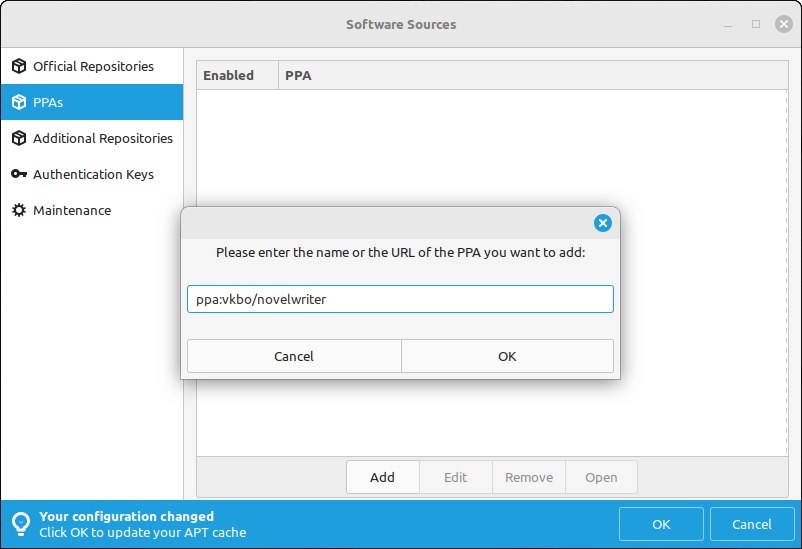

.. _main_install_linux:

*******************
Installing on Linux
*******************

.. _GitHub: https://github.com/vkbo/novelWriter
.. _PPA: https://launchpad.net/~vkbo/+archive/ubuntu/novelwriter
.. _Pre-Release PPA: https://launchpad.net/~vkbo/+archive/ubuntu/novelwriter-pre
.. _Releases: https://github.com/vkbo/novelWriter/releases
.. _AppImage: https://appimage.org/
.. _Fedora repository: https://packages.fedoraproject.org/pkgs/novelwriter/novelwriter/

There are different ways to install novelWriter, depending on your Linux distro. Here is a quick overview.

.. _main_install_linux_fedora:

Fedora
======

novelWriter is available in the main `Fedora repository`_ as of Fedora 41.

You can install it with:

.. code-block:: bash

   sudo dnf install novelwriter

.. _main_install_linux_ubuntu:

Ubuntu
======

A Personal Package Archive (PPA) is available for novelWriter on Launchpad. This is the most
straightforward way to install and update novelWriter on Ubuntu. It also works for other
Debian-based distros, but see the :ref:`main_install_linux_debian` section for more details on
this.

The Launchpad packages `are signed by the author <https://launchpad.net/~vkbo>`__.

You can add the Ubuntu PPA_ and install novelWriter with the following commands.

.. tab-set::

   .. tab-item:: Releases
      :selected:

      .. code-block:: bash

         sudo add-apt-repository ppa:vkbo/novelwriter
         sudo apt update
         sudo apt install novelwriter

   .. tab-item:: Pre-Releases

      .. code-block:: bash

         sudo add-apt-repository ppa:vkbo/novelwriter-pre
         sudo apt update
         sudo apt install novelwriter

.. _main_install_linux_mint:

Mint
====

The PPAs for Ubuntu can also be added to Linux Mint. The easiest way to do this is by using the
**Software Sources** app. Open it, and navigate to "PPAs" and click "Add". Enter the following:

.. tab-set::

   .. tab-item:: Releases
      :selected:

      .. code-block:: bash

         ppa:vkbo/novelwriter

   .. tab-item:: Pre-Releases

      .. code-block:: bash

         ppa:vkbo/novelwriter-pre

Remember to update your APT cache by clicking "OK" in the banner at the bottom of the window.

After that, you should be able to install novelWriter from the package installer tool or from the
command line.

.. _main_install_linux_debian:

Debian
======

A Debian package can be downloaded from :ref:`main_download`, or from the Releases_ page on GitHub_.
This package should work on both Debian, Ubuntu and Linux Mint, at least.

The install instructions for adding the Launchpad repository on Ubuntu do not work on Debian as
they are Ubuntu-specific. Instead, do one of the following:

.. tab-set::

   .. tab-item:: Debian 13 (Trixie) and Later
      :selected:

      As of Debian 13 (Trixie) and other Debian derivatives, the keyring format has changed.
      The following instructions use Sequoia to install the key in the correct format, and sets up
      the source file in the new format.

      If you don't have Sequoia installed, first run:

      .. code-block:: bash

         sudo apt install sq

      Import the keyring:

      .. code-block:: bash

         sudo sq network keyserver --server hkps://keyserver.ubuntu.com search "F19F1FCE50043114" \
               --output /usr/share/keyrings/novelwriter-ppa-keyring.gpg --overwrite

      Add the source file:

      .. tab-set::

         .. tab-item:: Releases
            :selected:

            .. code-block:: bash

               sudo sh -c "cat > /etc/apt/sources.list.d/novelwriter.sources" << EOF
               Types: deb
               URIs: http://ppa.launchpad.net/vkbo/novelwriter/ubuntu/
               Suites: noble
               Components: main
               Signed-By: /usr/share/keyrings/novelwriter-ppa-keyring.gpg
               EOF

         .. tab-item:: Pre-Releases

            .. code-block:: bash

               sudo sh -c "cat > /etc/apt/sources.list.d/novelwriter-pre.sources" << EOF
               Types: deb
               URIs: http://ppa.launchpad.net/vkbo/novelwriter-pre/ubuntu/
               Suites: noble
               Components: main
               Signed-By: /usr/share/keyrings/novelwriter-ppa-keyring.gpg
               EOF

   .. tab-item:: Debian 12 (Bookworm) and Earlier

      For Debian 12 (Bookworm) and older, and equivalent derivatives, use the old keyring format
      and apt sources list file format.

      Import the keyring:

      .. code-block:: bash

         sudo gpg --no-default-keyring --keyring /usr/share/keyrings/novelwriter-ppa-keyring.gpg \
                  --keyserver hkp://keyserver.ubuntu.com:80 --recv-keys F19F1FCE50043114

      Add the source list:

      .. tab-set::

         .. tab-item:: Releases
            :selected:

            .. code-block:: bash

               echo "deb [signed-by=/usr/share/keyrings/novelwriter-ppa-keyring.gpg] http://ppa.launchpad.net/vkbo/novelwriter/ubuntu noble main" | sudo tee /etc/apt/sources.list.d/novelwriter.list

         .. tab-item:: Pre-Releases

            .. code-block:: bash

               echo "deb [signed-by=/usr/share/keyrings/novelwriter-ppa-keyring.gpg] http://ppa.launchpad.net/vkbo/novelwriter-pre/ubuntu noble main" | sudo tee /etc/apt/sources.list.d/novelwriter-pre.list

      .. tip::
         If you get an error message like ``gpg: failed to create temporary file`` when importing the key
         from the Ubuntu keyserver, try creating the folder it fails on, and import the key again:

         .. code-block:: bash

            sudo mkdir -m 700 /root/.gnupg/

**Install novelWriter**

Then run the update and install commands as for Ubuntu:

.. code-block:: bash

   sudo apt update && sudo apt install novelwriter

AppImage Releases
=================

For other Linux distros than the ones mentioned above, the primary option is AppImage_. These are
completely standalone images for the app that include the necessary environment to run novelWriter.
They can of course be run on any Linux distro, if you prefer this to native packages.

Known Issues
------------

There are some known issues with the new AppImage files on some distros and desktop environments
after the switch to Qt6. If you get the following error:

.. code-block::

   qt.qpa.plugin: From 6.5.0, xcb-cursor0 or libxcb-cursor0 is needed to load the Qt xcb platform plugin.
   qt.qpa.plugin: Could not load the Qt platform plugin "xcb" in "" even though it was found.
   This application failed to start because no Qt platform plugin could be initialized. Reinstalling the application may fix this problem.

Try installing one of the suggested packages:

.. code-block:: bash

   sudo apt install libxcb-cursor0

A more permanent solution will come, but for the time being, installing the library should solve the issue.
