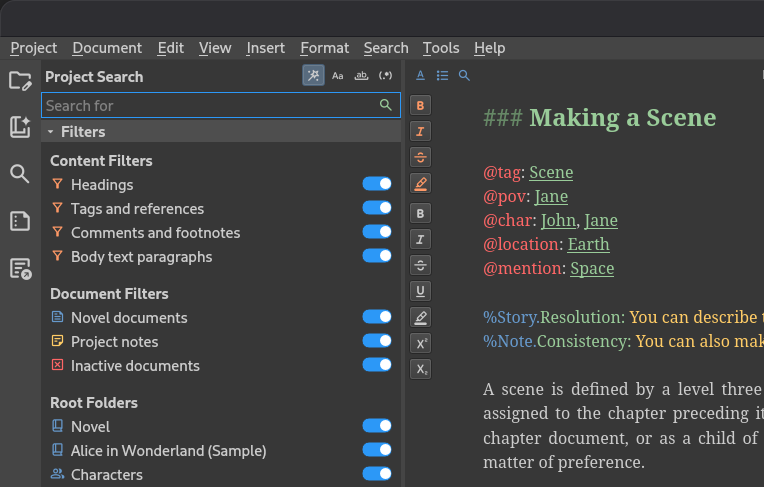
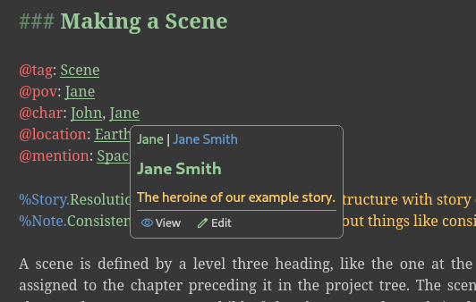

.. _main_release_26_2:

*************************
Pre-Release 2026.2 Beta 2
*************************

| **Release Date:** 2 August, 2026

Release Notes
=============

This release adds project writing goals with daily progress tracking, and a much improved project search with new
filters. There are also new manuscript tools, including EPUB export and dialogue statistics, and several new features
for the text editor, such as hover cards, zoom, and adjustable line height.

.. attention::

   This is a beta release of the next release version, and is intended for testing purposes. Please be careful when
   using this version on live writing projects, and make sure you take frequent backups.

.. attention::

   Note that the 2026.2 release will upgrade your project file structure, so once you've accepted the upgrade notice
   when opening a project for the first time, you will not be able to open it in earlier versions of novelWriter.

Project Writing Goals
---------------------

You can now set writing goals for your project and track your progress towards them on a daily basis. Progress is
shown as colour-coded progress bars in the status bar of the user interface. The daily progress resets automatically
when you start writing on a new day. Only content in novel root folders is counted, and if your project has multiple
novel folders, you can exclude some of them from the count in the project settings.

Note that the progress bars are only visible once you've set some writing goals, so to get started, go to the new Goals
tab in Project Settings and set them up!

Improved Project Search
-----------------------

The project search tool now has a collapsible filter panel below the search box, letting you narrow your search
results by text content, document type, and root folder. In addition, when you search in the editor, all matches for
your search term in the open document are now highlighted at once, not just the one currently selected, making it much
easier to see where else the term appears.

New Manuscript Features
-----------------------

novelWriter can now export your manuscript as an EPUB 3 file, alongside the existing output formats.

A new dialogue statistics view shows the number of characters used in dialogue, and the ratio of dialogue to prose
text, for your manuscript. The statistics panel has moved from below the manuscript preview to its own tab in the
panel on the left, alongside the outline and manuscript settings.

A few other manuscript features have also been added:

* You can insert a horizontal rule across the page in your manuscript by using four hyphens (``----``) as the heading
  format.
* The page break marker shown in the manuscript preview has changed from a solid block of text to a dashed line, and a
  font kerning issue when printing the preview on Windows has been fixed.
* Manuscript Build Settings has a new option to enable or disable justify-expansion of lines with manual line breaks,
  now also available for the Open Document and Word Document formats.

Text Editor Improvements
------------------------

Several improvements have been made to the text editor and viewer:

* You can now zoom the text in the editor and viewer in and out using the standard zoom shortcuts.
* A new setting in **Preferences** lets you adjust the line height of the text in the editor and viewer.
* Hovering over a tag in the editor or viewer now shows a hover card with buttons to quickly open the referenced
  document for editing or viewing.
* You can now paste rich text (HTML) into the editor, and it will be converted to novelWriter style markup. Copying text
  out of the editor still produces plain text as before.
* A new format checker highlights trailing spaces at the end of lines, in addition to the existing check for multiple
  spaces between words.
* The editor's auto-complete menu has been rewritten to use a more native look, with improved keyboard handling: arrow
  keys navigate the list, Left and Escape close it, and Tab, Enter, Return, and Right accept the highlighted entry.
* The symbol auto-replace feature can now also be used in the editor's search and replace boxes, the project search
  box, and the header format field in Manuscript Build Settings, and can be toggled on or off independently in each.

User Interface
--------------

Toggle buttons, such as those in the search tools, are now easier to see when active, using a new theme colour. Search
matches in the editor and project search results also use a new highlight colour, which now updates immediately when
you switch themes.

Tooltips and scrollbars once again correctly match your selected colour theme, after a compatibility issue with newer
versions of Qt had caused them to use the wrong colours. Some issues with how long labels are handled in switches, and
in the quick link and header navigation menus, have also been fixed.

Other Changes
-------------

* The automatic backup feature has a new setting for how often backups are made. You can set backups to run per session
  as before, or limit them to at most once per day, week, or month, in which case the previous backup for that period is
  overwritten instead of a new one being created every time.
* You can now recursively set the active or inactive state of all documents under a folder from the project tree's
  right-click menu.
* The Tools menu now shows a checkbox for the active project's spell check language, and the spell checker re-runs
  automatically whenever you change it.
* The item details panel below the project tree and novel view can now be collapsed.
* Performance of the spell checker has been substantially improved, and very long paragraphs are now skipped by syntax
  highlighting and spell checking to keep large documents responsive.

Download Links
==============

.. include:: ../generated/download_pre_release.rst

Older Releases
==============

Past release packages are available for download on `GitHub <https://github.com/vkbo/novelWriter/releases>`__.

| :octicon:`mark-github` `Download Release 26.2 Beta 1 <https://github.com/vkbo/novelWriter/releases/tag/v26.2b1>`__
