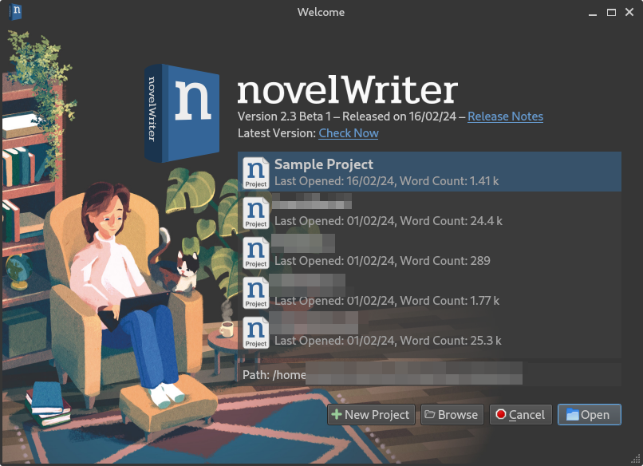
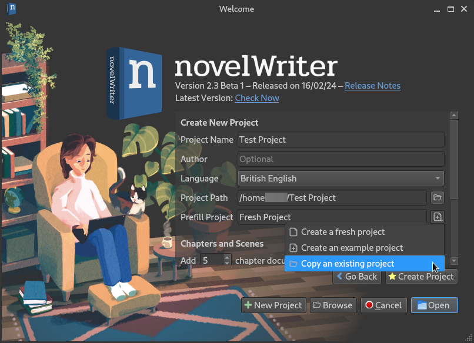
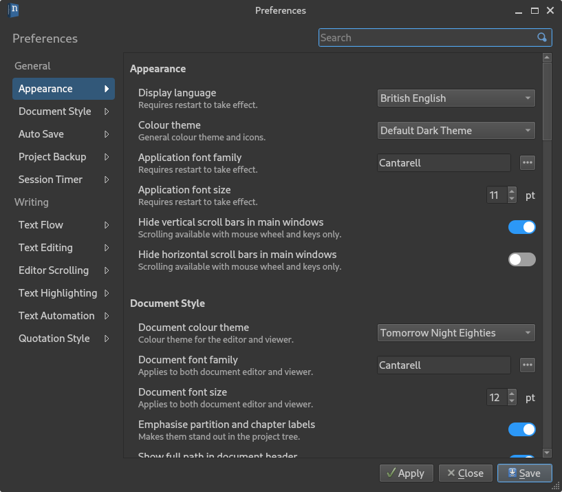
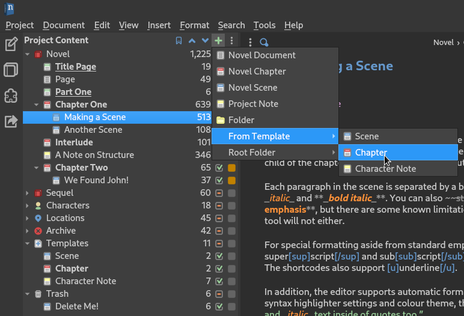

.. _main_release_2_3:

**********************
Pre-Release 2.3 Beta 1
**********************

| **Release Date:** February 16, 2024

Release Notes
=============

.. attention::

   This is a beta release of the next release version, and is intended for testing only. Please be careful when using this version
   on live writing projects, and make sure you take frequent backups.

Welcome Dialog
--------------

The first change you will notice when launching novelWriter 2.3 is the new **Welcome** dialog. It replaces both the old **Load
Project** dialog, as well as the **New Project Wizard**, and combines their functionality into one. You will also notice the amazing
artwork in the background, which has been created specially for novelWriter by `Louis Durrant <https://louisdurrant.art>`__.

The list of projects has gotten a cleaner design, but otherwise contains the same information as before. You can remove projects
from the list by right-clicking on them and selecting "Remove Project".

At the top of the dialog is also information about the current version of novelWriter, and a link to the releases page here on the
website. You can also query for information about the latest release by clicking the "Check Now" text. This replaces the old
**Check for Updates** dialog that used to be in the **Help** menu.

The functionality that used to be on the **New Project Wizard** is now available when you click the "New Project" button. The
settings are mostly as before, but note that you can now also choose to create a project by copying an existing project. That
project can be a special project you've created to be a template project if you wish. It can also be a novelWriter project in a Zip
file, including one of your backups.

The **About novelWriter** dialog has been updated to a similar design as the **Welcome** dialog, with the same header and version
check capability. All the text tabs have been removed, aside from the credits. The release notes will no longer be available in the
About dialog. They are instead now only kept here on this website. This allows for better formatting of the notes, a capability the
in-app text box lacked.

Consistent Design
-----------------

All of the dialogs in novelWriter that contain multiple pages of information or settings have been updated to a new layout and
design first introduced for the new **Manuscript** tool in 2.1.

Most importantly, perhaps, the **Preferences** dialog has been redesigned. All settings are now in a scrollable list, with quick
navigation along the left edge and a search box at the top. The new layout is also a lot more flexible in terms of text flow,
allowing for a better response to languages where text tend to run longer, like German.

In addition to **Preferences**, also the **Project Settings**, **Project Details**, and **Manuscript Build Settings** dialogs have
been updated to use a similar design.

New Features
------------

New design is not the only new stuff added in 2.3. A number of user-requested features have been added as well.

* A new root folder type called "Templates" is now available. Any document added to this folder will be available in the "Add Item"
  menu. You can create a new document like you normally do, but selecting a template from the "From Template" submenu will populate
  the new document with the content of the selected template.

* You can now insert the name of a scene or chapter's "Point of View" or "Focus" character directly into the title in the
  **Manuscript** tool. They work just the same way as the other header formatting features from the 2.1 version, like automatic
  chapter numbers. By default, the name inserted is the text of the ``@tag`` you specify in the character's note. However, if you
  want the name to appear in a different way in the manuscript, you can set a "display name" after a ``|`` symbol:

  .. code-block:: md

     # Main Character: Jane

     @tag: Jane | Jane Smith

* A new way to eliminate text you don't want to be included in the manuscript has been added. It's called "Ignore Text" in the
  **Format** menu. Previously, you may have "commented out" text you wanted to exclude, but that's impractical if you actually want
  your comments included in, say, a draft manuscript. If you instead use this ignore text format, the text will *never* be included
  anywhere, regardless of other settings. The format differs only slightly from regular comments:

  .. code-block:: md

     ### My Scene

     % This is a comment I want included in my draft.

     %~ This is a paragraph I want out of my text, but haven't yet decided to delete.

  Just like regular comments, these also don't count towards your word count.

Other Improvements
------------------

Among other, smaller improvements are:

* You can now create regular documents and folders directly by right-clicking in the project tree. Root folders and template
  documents must be created from the "Add Item" menu button still.
* You can change the label of a document in the project tree by right-clicking it and selecting "Rename to Heading", if there is a
  heading in the document already.
* When multiple paragraphs are selected in the editor, activating one of the formatting commands in the **Format** menu starting
  with "Toggle", will apply the formatting change to all selected text instead of just the first paragraph.
* You can now filter out tags from project notes set to "Inactive" in the little triple-dot menu in the **References** panel under
  the document viewer.
* You can customise the format of the Document header in Open Document files created from the **Manuscript** tool from the
  **Manuscript Build Settings** dialog.
* The words in the **Project Word List** can now be exported to a plain text file, and also imported from such a file. Only unique
  words are imported.
* The content of the table in the **Project Outline** can be exported to a CSV file, which can then be imported as a spread sheet in
  for instance Excel or Open Office Calc. The export is initiated from a new "Export CSV" button in the toolbar above the outline.

Next Pre-Release
----------------

The next upcoming pre-release of novelWriter 2.3 will be 2.3 RC 1.

You can follow the development progress on the `2.3 RC 1 Milestone <https://github.com/vkbo/novelWriter/milestone/72>`__.

Feedback for the 2.3 Beta 1 release can be posted on the `GitHub Discussions <https://github.com/vkbo/novelWriter/discussions/1699>`__ thread.

Download Links
==============

.. include:: ../generated/download_pre_release.rst
