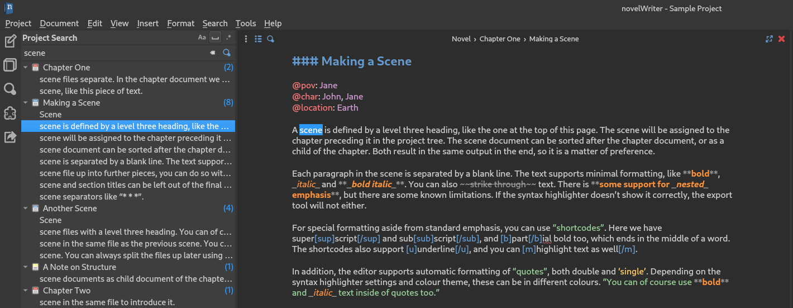
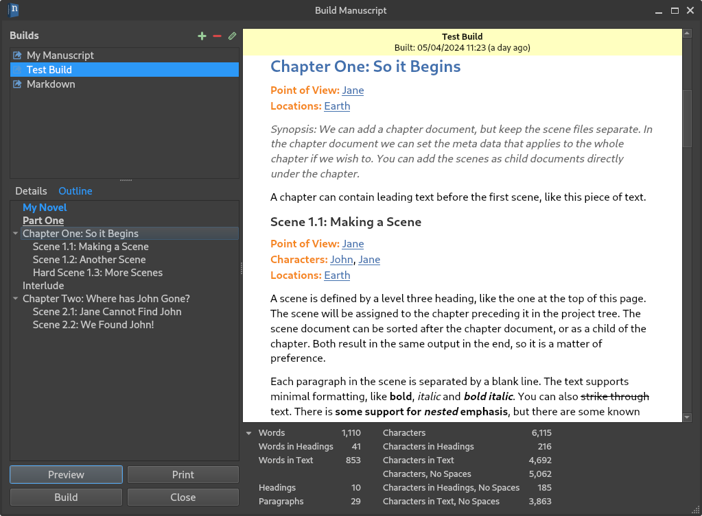

.. _main_release_2_4:

***********
Release 2.4
***********

| **Release Date:** April 20, 2024
| **Patches:** :ref:`2.4.1 <main_release_2_4_1>`, :ref:`2.4.2 <main_release_2_4_2>`, :ref:`2.4.3 <main_release_2_4_3>`,
  :ref:`2.4.4 <main_release_2_4_4>`

Release Notes
=============

Release 2.4 mostly focuses on adding requested features to the Manuscript tool, but there are also other changes to the main user
interface that may prove useful.

New General Features
--------------------

A new project search tool has been added. It is a long requested feature, and it can be activated by clicking the magnifying glass
icon on the side bar, or by pressing :kbd:`Ctrl+Shift+F`. You have the option to make the search case sensitive, include only whole
words, and turn on regular expressions if you wish to make more advanced searches.

Other new features includes outline menus for the document editor and viewer. They can be activated by clicking the list icon at the
top left of the document headers. This should make it easier to navigate long documents.

Highlight Text
--------------

A new shortcode is available for highlighting text. It only applies to HTML and Open Document manuscripts, and it is also added to
Extended Markdown manuscripts using the non-standard ``==`` codes.

To highlight a piece of text in novelWriter, you can wrap the text in ``[m]text[/m]`` codes, click the new highlight button on the
toolbar, or select it from the **Format** menu.

**Example:**

.. code-block:: md

   ### Scene

   Some text with [m]this bit highlighted.[/m]

Soft and Hard Scene Breaks
--------------------------

If you need to distinguish between "soft" and "hard" scene breaks in your project, you can now indicate "hard" scenes by adding an
``!`` to the heading format. The old scene headings are considered "soft" by default. This syntax has no effect on how the scenes
are treated by the application in general. The only difference between them is that you can format them differently when you create
your manuscript document. See the section below.

**Example:**

.. code-block:: md

   ### A Soft Scene Heading

   Text

   ###! A Hard Scene Heading

   Text

Manuscript Tool Changes
-----------------------

The Manuscript Build Tool now shows a set of word and character counts of the text displayed in the preview window. The counts are
shown at the bottom of the window, and by default only show the word and character counts. By clicking the little arrow icon the
panel is expanded to show a number of other counts as well.

In addition to the word and character counts, an outline of the previewed manuscript is now available in a tab next to the build
settings on the left. The outline shows partition and chapter headings at the top level with scenes under chapters if scene titles
are generated. For notes, level 1 and 2 headings are shown. All other heading levels are ignored.

There are also new settings for each build. Here is a summary:

* You can now control centring and page breaks for partition, chapter and scenes in the novel part of your project.
* You can select to hide any heading level in novel documents, not only scenes and sections like before.
* You can now specify a different scene heading format, or a different scene separator, for so-called "hard scene breaks". You have
  to specify which scene headings are considered as such in the text by using ``###!`` to indicate the heading instead of the
  regular ``###``.
* If you include meta data lines in your manuscript, you can now filter out those you don't want included.
* You can apply first line indentation to text paragraphs in the manuscript for Open Document manuscript files.
* You can exclude hard line breaks from Markdown manuscript files.

Patch Releases
==============

.. _main_release_2_4_1:

Patch 2.4.1
-----------

**Release Date:** May 6, 2024

This is a patch release that fixes a number of minor issues with the Manuscript Build tool. The only critical fix is related to a
potential crash when deleting a build entry when its settings dialog is still open. A few minor improvements also include
remembering the scroll position when updating the Manuscript Build preview. It also includes a change in the document editor and
viewer where the font used for the document header and footer now matches the user interface font instead of the text font.

.. _main_release_2_4_2:

Patch 2.4.2
-----------

**Release Date:** May 18, 2024

This is a patch release that fixes two minor font issues and updates the Dutch and Chinese translations.

The first font issue was with the preview of the **Manuscript Build** tool where the yellow header banner would use the document
font set in preferences, while the previewed document itself would use whatever font was selected for the build itself. The banner
now uses the GUI font instead.

The second font issue occurred when the document font size was created in preferences. The headings in the editor would not be
rescaled according to the new size until the application was restarted. The headings now scale proportionally without a restart.

.. _main_release_2_4_3:

Patch 2.4.3
-----------

**Release Date:** May 20, 2024

This is a patch release that fixes issues with the document font in the editor, viewer and manuscript preview on some Linux distros.
The font would not be set correctly after a restart of the app. It is known to affect Linux Mint 21.3, and may also affect other
distros. This patch also fixes a potential crash when using the spell check dictionary install tool. The crash occurs when the
default folder for the library that runs the spell checking in novelWriter does not exist prior to using the tool to add new spell
check dictionaries. The bug primarily Windows users where the system's spell check dictionaries cannot be used, and this is the only
way to install new dictionaries.

.. _main_release_2_4_4:

Patch 2.4.4
-----------

**Release Date:** June 12, 2024

This is a patch release that fixes two minor issues, and also updates the Portuguese translation.

The first issue is concerning settings document label from document heading before the document is saved. The document is now
automatically saved before the heading text is extracted. The second issue is a potential crash when closing the Manuscript Build
dialog. There is a few milliseconds every 10 seconds when the yellow label in the preview is updated where novelWriter may crash
if the Manuscript tool is closed. There is a very low chance to hit this moment, but it is possible.

Download Links
==============

.. include:: ../generated/download_release.rst

Older Releases
==============

Past release packages are available for download on `GitHub <https://github.com/vkbo/novelWriter/releases>`__.

| :octicon:`mark-github` `Download Release 2.4.3 <https://github.com/vkbo/novelWriter/releases/tag/v2.4.3>`__
| :octicon:`mark-github` `Download Release 2.4.2 <https://github.com/vkbo/novelWriter/releases/tag/v2.4.2>`__
| :octicon:`mark-github` `Download Release 2.4.1 <https://github.com/vkbo/novelWriter/releases/tag/v2.4.1>`__
| :octicon:`mark-github` `Download Release 2.4 <https://github.com/vkbo/novelWriter/releases/tag/v2.4>`__
| :octicon:`mark-github` `Download Release 2.4 RC 1 <https://github.com/vkbo/novelWriter/releases/tag/v2.4rc1>`__
| :octicon:`mark-github` `Download Release 2.4 Beta 1 <https://github.com/vkbo/novelWriter/releases/tag/v2.4b1>`__
