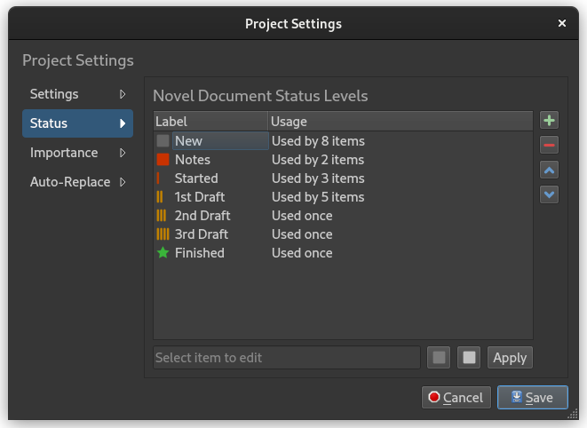
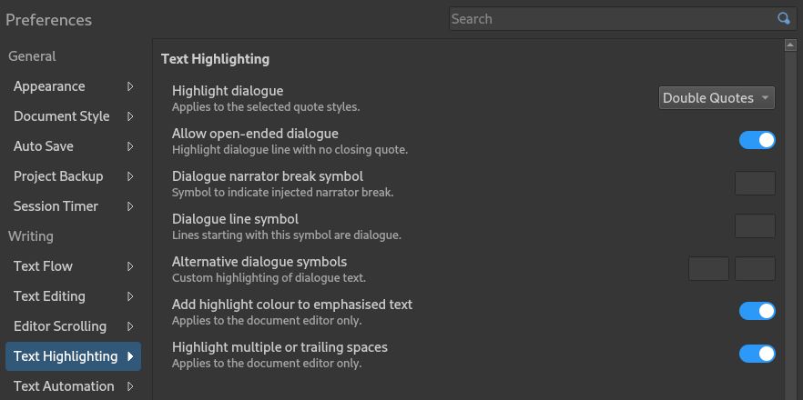

.. _main_release_2_5:

***********
Release 2.5
***********

| **Release Date:** July 10, 2024
| **Patches:** :ref:`2.5.1 <main_release_2_5_1>`, :ref:`2.5.2 <main_release_2_5_2>`

Release Notes
=============

Status Icon Shapes
------------------

You can now select icon shapes in addition to icon colour for your Status and Importance icons. This should make it a lot easier to
distinguish the different levels you have defined.

This feature should both improve accessibility, but also be generally helpful to indicate progress states as there are several icon
types that has progression indication built into them, like progress bar, blocks, or circle progress icons.

Theme Additions
---------------

Two new themes have been added:

* The popular `Dracula <https://draculatheme.com/>`__ dark theme is now available as both a GUI theme and a matching syntax theme
  for the editor to give a complete vampire feel.
* A vivid light theme named `Snazzy Light <https://github.com/loilo/vscode-snazzy-light>`__ is also available. This is a pure editor
  theme which should go with the **Default Light** GUI theme.

In addition to the new themes, many of the current themes have been updated and improved. Primarily, the changes focused on making
them more consistent, so that all Tomorrow themes use the same colours for the same parts as other existing themes.

New theme colours were also added. In particular, special comments, like synopsis comments and the new footnote comments, are no
longer shown in grey, but in a lighter colour.

Support for Footnotes
---------------------

The shortcodes that were introduced in 2.2 have been extended to allow inserting footnotes in the text. The footnote reference is
inserted as ``[footnote:key]`` at the location where the footnote reference is to be used, where ``key`` is a keyword that is used
to link the footnote to its text.

The footnote text itself is added as a comment similar to the way synopsis comments are added, but with the key indicated. Here's an
example:

.. code-block:: md

   ### Scene

   This is a paragraph with a footnote added.[footnote:fn1]

   %Footnote.fn1: This is the text of the footnote.

The footnote comment must be specified in the same document as the reference, but it can appear in any position in the document, so
you can put it after the paragraph, or at the bottom of the document.

The footnotes are displayed in the document viewer, so you can test how they look there for any given document. They are also
included in both Open Document, HTML and Markdown manuscript formats.

If you think it's tricky to remember the formats for a footnote, you can put the cursor where you want the footnote reference to
appear in the editor, and go to the **Insert** and select **Footnote**. This will generate the needed code tags and create a unique
key for it, so you don't have to think about this.

Character Dialogue
------------------

The dialogue highlighting feature has been improved, and a number of new settings added in a new section in **Preferences**.

* Dialogue highlighting can be applied to single or double quotes as specified in the "Quotation Style" section, or both styles.
  You can of course also disable the feature altogether.
* As before, you can allow quote symbols to be open-ended. That is, not require the closing quote symbol to appear in a paragraph.
* You can add a symbol that will be interpreted as a narrator break, which is a requested feature to support Spanish dialogue style.
* You can specify a symbol that indicates that a paragraph is entirely dialogue. The symbol must be the first character of a
  paragraph. This is also a common dialogue style in many languages. Often this symbol is a dash.
* You can also define your own alternate open and close dialog symbol set. Some authors invent new notation to indicate a special
  kind of dialogue, and that is now also supported. This dialogue uses a different colour from the syntax theme than regular
  dialogue.
* Text in quotes in notes are not considered dialogue. They are no longer highlighter.

Font Settings
-------------

The font settings for the user interface and document now uses the full range of font style options available. This means that the
additional font size settings in **Preferences** have been removed and are now a part of the general font options.

Since not all platforms have a full range of font style options available in their font selection dialog, you can turn off the
"Use the system's font selection dialog" setting. This will force the usage of the internal font dialog provided by Qt, which has a
full set of font style options. At least on Linux Gnome desktops this is known to be an issue.

.. note::
   Due to the additional font size setting being dropped, the old font size setting is lost and has to be selected again from
   **Preferences**.

Other Changes
-------------

* All comment types, including synopsis comments and the new footnotes, can now have formatting in the text. That is, you can use
  the regular Markdown and shortcode codes there just as in regular text.
* First line indent is now available as a general manuscript setting, and applies to both Open Document and HTML output. It is also
  visible in the preview document. The custom line height setting is also visible in the preview.
* The way documents are generated for the document viewer and the manuscript preview has been rewritten. The new approach allows for
  much more flexibility in how the text is formatted. The first change you may notice is that the heading font size now matches that
  of the document editor, something that wasn't possible with the old approach. Other formatting will also be improved in future
  releases.
* The new project form on the Welcome dialog is now less restrictive about what characters you can put in the project folder name.

Technical Changes
-----------------

* Python 3.9 is now the minimum requirement to run novelWriter. Qt 5.15 is also required. For Windows, MacOS, and Linux AppImage
  releases, these dependencies are already included, but for Debian packages they are not. This means support for Ubuntu 20.04 and
  Debian-based distros of a similar age, ``.deb`` packages are no longer provided.

Patch Releases
==============

.. _main_release_2_5_1:

Patch 2.5.1
-----------

**Release Date:** July 28, 2024

This is a patch release that fixes an issue with the lock file being left in the project when the project open is cancelled, a few
issues with custom input boxes in Preferences, and a usability issue when selecting to edit a tag or reference from the Tags and
References panel as well as fixed an issue with the Importance labels not being updated in the tabs for tags.

.. _main_release_2_5_2:

Patch 2.5.2
-----------

**Release Date:** September 17, 2024

This is a patch release that fixes a series of issues mostly affecting dialogue highlighting in the document viewer. The way the
text is formatted in the viewer changed a lot in 2.5, and there were a few issues with the new implementation. The tab stop distance
setting was also ignored by the updated document viewer, but has now been fixed as well.

Download Links
==============

.. include:: ../generated/download_release.rst

Older Releases
==============

Past release packages are available for download on `GitHub <https://github.com/vkbo/novelWriter/releases>`__.

| :octicon:`mark-github` `Download Release 2.5.1 <https://github.com/vkbo/novelWriter/releases/tag/v2.5.1>`__
| :octicon:`mark-github` `Download Release 2.5 <https://github.com/vkbo/novelWriter/releases/tag/v2.5>`__
| :octicon:`mark-github` `Download Release 2.5 RC 1 <https://github.com/vkbo/novelWriter/releases/tag/v2.5rc1>`__
| :octicon:`mark-github` `Download Release 2.5 Beta 1 <https://github.com/vkbo/novelWriter/releases/tag/v2.5b1>`__
