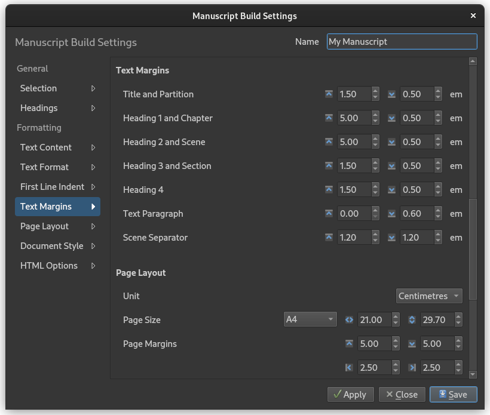
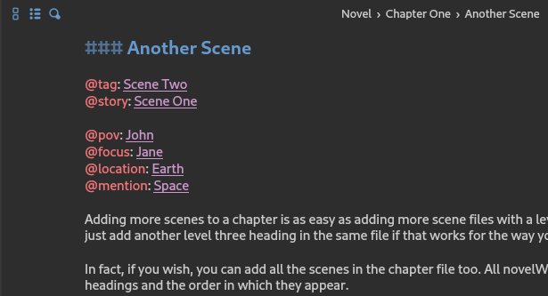

.. _main_release_latest:
.. _main_release_2_6:

***********
Release 2.6
***********

| **Release Date:** January 26, 2025
| **Patches:** :ref:`2.6.1 <main_release_2_6_1>`, :ref:`2.6.2 <main_release_2_6_2>`, :ref:`2.6.3 <main_release_2_6_3>`

.. _Issues: https://github.com/vkbo/novelWriter/issues

Release Notes
=============

New Manuscript Features
-----------------------

This release has largely focused on the Manuscript Build tool, and a number of new features have been added. The code behind all the
output formats has also been extensively restructured to ensure better consistency between the preview and the various outputs.

The Build Settings dialog has also been redesigned to match other, similar dialogs. All customisation settings, aside from the two
first pages, have been moved into a long, scrollable form with quick-navigations links on the left.

The new features are:

* You can now generate a PDF of your manuscript.
* You can also generate a Microsoft Word (DocX) document. It should have all the same features as the Open Document format (ODT).
  The new DocX format has been validated against the document standard and tested in the online Office 365 version. The format is
  still new, and may have issues, so if you have any problems, please report them on the project's Issues_ page.
* You can now also control the page break and title centring of the main novel title. This is particularly useful if you want to add
  text above the title on the cover page, and want to turn off the automatic page break.
* You can now customise the styling of headings, and even turn them off completely if your manuscript standard calls for headings to
  be styled the same way as plain text. You can also adjust top and bottom margins of heading types and text paragraphs.
* Word count statistics, and other related statics values, can be inserted into the manuscript. The value fields must be added to
  the document itself in the editor, using the new **Insert > Word/Character Count** menu entry. In the document viewer, they are
  shown as 0, but they are set to the correct value in the Manuscript preview.
* If you have enabled the option to ignore line breaks in text paragraphs in your Build Settings, you can still force line breaks in
  the text where you want them by adding ``[br]`` shortcodes. You can also add a line break after these, for a better visual
  look in the editor. This will not produce double line breaks.
* You now have the option to show page breaks in the Manuscript preview panel. They are enabled by default, but can be disabled with
  a little switch below the preview window.

Other changes include:

* Chapters in your manuscript are now exported as level 1 headings for all document formats. Previously they were level 2, but this
  is not the convention for chapters as chapters are the primary division of a novel. Scenes are level 2 if scene headings are
  included. Partition titles are still included, but they are no longer marked as headings in office documents, but are marked as
  level 1 headings in Markdown and HTML output. Headings in notes remain as before.

Tags and References
-------------------

It has always been possible to add a ``@tag`` to your novel documents. However, there was no dedicated keyword to reference these
tags if you needed to cross-reference between novel documents or from notes. You can now do that with the ``@story`` keyword. It
works exactly the same as all other reference keywords.

In addition, a new special ``@mention`` keyword has been added. It is intended for referencing story elements that are not present
in a given chapter or scene, but is discussed. So if your Point-of-View character takes about someone who isn't present in the
scene, you may still want to indicate that they're mentioned so you can go back later and check for story consistency. This is
precisely what the ``@mention`` keyword is for.

Better Dialogue Highlighting
----------------------------

The dialogue highlighting was redesigned for 2.5 to not be mere quoted text highlighting, but also support other dialogue styles
that don't rely on quote symbols like English and other languages do. A few features tailored for Spanish were added in 2.5.

However, the Spanish style added in 2.5 did not work for Portuguese and Polish, based on user feedback. In this release, the
dialogue highlighting has been redesigned again to accommodate more style variations. There are now three highlighting settings in
Preferences dedicated to this, and you can play around with them to test it out. They are all intended to be used with dashes, but
you decide what symbols they should detect.

To allow for resolving ambiguities where the syntax highlighter guesses something is dialogue, while the author did not intend it to
be, you can use a horizontal bar as a replacement for long dash. They look more or less identical in most fonts, and horizontal bars
are automatically replaced with long dashes in the manuscript. However, the dialogue highlighting feature sees them as different
symbols. Horizontal bars are inserted automatically in the text when you type 4 hyphens after one another.

The requirement that dialogue in quotes must also include whitespaces on the outer margin has been removed. These are not
necessarily present in languages that don't rely on whitespaces to separate words like in Chinese. The whitespaces *are* still
required if the open and close symbols are identical, and therefore indistinguishable.

User Interface Improvements
---------------------------

The functionality behind the project tree has been completely rewritten. For you as the user, the changes should be minimal. The
change mainly provides better control of the project tree's behaviour. The main change for users is a better implementation of
drag and drop where multiple items can be moved around without as many restrictions as before. The root level of the tree is still
locked though.

A new bonus feature from the project tree changes is that you can now drag and drop project documents onto the editor and viewer
panels to open them.

There are a few other improvements to the overall user interface as well.

* URLs starting with "http" are now clickable in both editor and viewer, and are also exported as links in manuscript documents.
* A new edit button is available from the top--right corner if the document viewer. Clicking it will open the current document in
  the document editor.
* The currently open document in the editor is now highlighted in the project tree, just like it is in the novel view.
* You can now changes the size of the two parts of the details panel below the Outline View.
* The status label with icon is now available as an optional column in the Outline View.
* The story tag is now available as an optional column in the Outline View, if you use such tags.
* If you don't want to see the clock on the status bar that measures the amount of time used in the current session, you can now
  click on it to hide it. Only the icon will be visible. Clicking the icon, will show the timer again.
* Status and importance labels can now be exported to a CSV file from Project Settings, and imported into another project.

Patch Releases
==============

.. _main_release_2_6_1:

Patch 2.6.1
-----------

**Release Date:** February 2, 2025

This is a patch release that fixes an issue with creating new notes from the editor context menu, adds an option to turn off the
confirmation box that pops up when closing novelWriter, and improves the recent project list on the Welcome dialog.

A French version of the user guide is now also available when the localisation is set to French, and the French, Latin American
Spanish, Norwegian, US English, German and Japanese translations of the application have been updated.

.. _main_release_2_6_2:

Patch 2.6.2
-----------

**Release Date:** February 16, 2025

This is a patch release that fixes a few issues with the project tree: The Empty Trash option in the menu now works again, and it is
no longer possible to accidentally drag and drop project items onto the root of the project tree.

In addition, a Czech translation has been added by Tomáš Zmek, and the Italian, Polish and Brazilian Portuguese translations have
been updated.

.. _main_release_2_6_3:

Patch 2.6.3
-----------

**Release Date:** February 16, 2025

This is a patch release that fixes a translation issue that affected several labels on the user interface where the wrong or no
translation was used. The bug affected all languages except for English.

Download Links
==============

.. include:: ../generated/download_release.rst

Older Releases
==============

Past release packages are available for download on `GitHub <https://github.com/vkbo/novelWriter/releases>`__.

| :octicon:`mark-github` `Download Release 2.6.1 <https://github.com/vkbo/novelWriter/releases/tag/v2.6.2>`__
| :octicon:`mark-github` `Download Release 2.6.1 <https://github.com/vkbo/novelWriter/releases/tag/v2.6.1>`__
| :octicon:`mark-github` `Download Release 2.6 <https://github.com/vkbo/novelWriter/releases/tag/v2.6>`__
| :octicon:`mark-github` `Download Release 2.6 RC 1 <https://github.com/vkbo/novelWriter/releases/tag/v2.6rc1>`__
| :octicon:`mark-github` `Download Release 2.6 Beta 2 <https://github.com/vkbo/novelWriter/releases/tag/v2.6b2>`__
| :octicon:`mark-github` `Download Release 2.6 Beta 1 <https://github.com/vkbo/novelWriter/releases/tag/v2.6b1>`__
