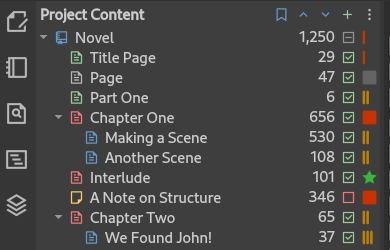

.. _main_release_2_7:

********************
Pre-Release 2.7 RC 1
********************

| **Release Date:** May 19, 2025

.. _Issues: https://github.com/vkbo/novelWriter/issues

Release Notes
=============

.. attention::

   This is a pre-release of the next release version, and is intended for testing only. Please be careful when using this version
   on live writing projects, and make sure you take frequent backups.

   You can follow the development progress on the `2.7 RC 1 Milestone <https://github.com/vkbo/novelWriter/milestone/96>`__.

Major Theme and Icon Updates
----------------------------

The old multi-colour icon theme has been replaced by three new icon themes: Font Awesome 6, six variations of Material Icons, and
two variations of Remix Icons. The default theme is Material Icons, but you can change this from Preferences under "Appearance".

The new icons are single coloured, and use highlight colours from the selected GUI theme. That means the colours of icons will now
match the selected theme. In Preferences under "Project View" you can customise the look of the icons used for project items
further. By default, root folders and regular folders have separate colours, and the document types retain their colours indicating
partition, chapter, scene or notes as before. However, if you prefer all your icons to be one colour, you can pick one of several
pre-defined theme colours from these settings. You can also choose to preserve the colour coding of the documents and only set a
single colour for the folder icons.

Story Structure Comments
------------------------

Story Structure Comments are a new style of comments that can be used to annotate your scenes with structure information. The
feature was proposed by Alan Langford in `this discussion thread <https://github.com/vkbo/novelWriter/discussions/1769>`__ and
implemented based on a proof of concept.

A story structure comment consists of the standard comment symbol ``%``, a ``story`` keyword and a custom term, before the comment
itself. Here's an excerpt from the documentation written for this feature to explain its usage:

   The story term can be anything that you want to track in the manuscript. This construct is intended
   to make it easier to extract metadata from a work to perform a structural analysis of the story.

   There are probably as many ways to examine story structure as there are authors and editors
   combined. For this reason the story tag is flexible. You can use any terms you want and track any
   aspect of the story that serves your purposes.

   An example method has been advanced by Shawn Coyne in *The Story Grid*. This method asserts that a
   story is composed of "beats", and that each beat has an inciting incident, a complication, a
   crisis, and a resolution. One might capture these elements of a beat where a character overcomes
   their fear of giving a speech as:

   .. code-block:: md

      ### Scene

      %Synopsis: Carol overcomes her fear of giving a speech.

      %Story.incite: Carol is pleased to be invited to a conference to see her boss deliver a keynote.
      %Story.complication: Carol's boss calls in sick and asks her to deliver a big speech.
      %Story.crisis: Carol has a fear of appearing on stage.
      %Story.resolution: Carol engages the help of a coach who helps her overcome her fears and delivers a great speech.

   Other analytical models propose tracking a scene's pace, how it affects the mood of the story, or
   which element(s) of the story's genre are being satisfied. An author can use this mechanism to
   track any element of a scene. Some examples include time of day, how much time passes in the scene,
   or even the physical form of a shape-shifting character. If a story involves magic, one could track
   which wand a main character has in hand. It's up to tha author.

   When the story and other scene metadata is extracted into a tabular form, it is possible to get a
   comprehensive overview of the story and to identify possible issues. For example, so many
   fast-paced scenes without a break that readers might become fatigued or over-stimulated.

For the time being, the structure comments can be included in the manuscript, or exported to a spread sheet from the Outline View.
More ways of displaying these comments will be added in later releases. We're planning several upgrades to the Outline View for
instance.

Manuscript Notes
----------------

While Story Structure Comments are designed for a very specific purpose, Manuscript Notes are more general. They are written the
same way though, and you can include or exclude them independently from Story Structure Comments in the Manuscript Build Settings.
They are formatted like this:

.. code-block:: md

   ### Scene

   %Synopsis: Carol overcomes her fear of giving a speech.

   %Note.consistency: This is where Carol meets her coach for the first time.

More ways to display and search these notes will be added in future releases.

Other Changes
-------------

Under the hood, novelWriter has switched to version 6 of the Qt framework. The main difference for you as a user of the application
is better support for High DPI monitors and pixel scaling. This should also include better support for handling different font
styles for the editor.

In addition to the above, and other under-the-hood changes, a few smaller improvements have also been made:

* A new setting in Preferences lets you switch from word count to character count as the main value shown on the main user
  interface in the project tree, novel view, and on the status bar. Word count is not a useful statistics in all languages.
* The thickness of the editor cursor can now be adjusted in Preferences under "Text Editing".
* The logic of where new documents are added in the project tree has been enhanced, and hopefully it should pick a sensible location
  near the document you have selected.
* Dialogue highlighting for single quoted dialogue in conjunction with apostrophes has been improved somewhat. Distinguishing
  between the end of dialogue and an apostrophe used to contract the tail end of a word is still not possible, but it should behave
  better for contractions inside words.
* Improvements to accessibility has been made in several areas. Screen reader support is improving, but not yet complete, but all
  switches have been associated with a label now. Keyboard navigation support is improved, especially for switches, and new projects
  will now generate defaults status and importance labels using shapes in addition to colours to make them easier to distinguish for
  users with low colour vision.

Download Links
==============

.. include:: ../generated/download_pre_release.rst

Older Releases
==============

Older Releases
==============

Past release packages are available for download on `GitHub <https://github.com/vkbo/novelWriter/releases>`__.

| :octicon:`mark-github` `Download Release 2.7 Beta 1 <https://github.com/vkbo/novelWriter/releases/tag/v2.7b1>`__
